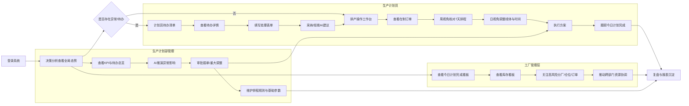

# 格力高级计划排程系统（APS）工厂侧用户操作手册

适用版本：v3.6  
适用对象：业务单位（工厂侧）业务操作人员，包括生产计划员、生产计划部管理、工厂管理层（总装厂长、配套厂长等）  
适用范围：当前产品原型页面，包括登录、决策分析、排产操作、计划员待办、在制订单、预排订单、库存看板、今日计划完成看板、系统设置等模块。

## 1. 手册说明

本手册用于指导工厂侧用户在 APS 原型中完成日常排产查看、排程调整、异常处理、执行确认、过程追踪与管理分析。文档以业务角色为主线，结合系统页面实际按钮、字段和操作路径编写。

原型中部分数据为演示数据，实际投产后应以 ERP、MES、WMS、CRM、IoT 等系统同步数据为准。若页面弹出提示、确认框或执行进度条，应等待系统反馈后再进行下一步操作。

## 2. 角色与职责

| 角色 | 主要目标 | 重点模块 | 典型操作 |
|---|---|---|---|
| 生产计划员 | 完成每日排产、异常调整、订单跟踪和待办闭环 | 排产操作、计划员待办、在制订单、预排订单、今日计划完成看板 | 查看在制订单、调整甘特排程、处理待办、执行方案、跟踪完成率 |
| 生产计划部管理 | 统筹多分厂计划节奏、审批排产策略、关注异常风险 | 决策分析、AI推演工作台、计划员待办、系统设置、报表中心 | 查看全局 KPI、评估 AI 建议、审批插单与异常处理、配置规则与参数 |
| 工厂管理层 | 掌握工厂达成、库存、风险和跨厂协同状态 | 决策分析、库存看板、今日计划完成看板、排产操作月/周视角 | 查看关键指标、追踪分厂完成情况、关注高风险仓位和重大异常 |

## 3. 通用操作

### 3.1 登录系统

1. 打开 `login.html` 登录页。
2. 输入账号与密码。
3. 点击登录按钮进入系统首页。
4. 如需找回密码，点击“忘记密码？”按页面提示处理。

### 3.2 顶部导航

系统顶部包含以下主导航：

| 菜单 | 用途 |
|---|---|
| 决策分析 | 查看全局 KPI、计划员工作台、AI 推演、库存与计划完成入口 |
| 排产操作 | 查看和执行排程、编辑甘特任务、查看在制与预排订单 |
| 系统设置 | 管理基础参数、用户信息、数据同步、系统对接、角色权限、审计日志等 |

顶部右侧常用区域：

| 功能 | 操作说明 |
|---|---|
| 制造基地 | 通过下拉框切换总部/基地视角 |
| 时间 | 显示当前系统时间 |
| 通知铃铛 | 查看系统消息、异常提醒和待处理通知 |
| 深色/浅色 | 切换系统显示风格 |
| 用户下拉 | 点击用户头像或姓名，可进入“用户信息”或退出登录 |

## 4. 生产计划员操作指南

### 4.1 每日开工前检查

生产计划员建议按以下顺序完成开工检查：

1. 进入“决策分析”。
2. 查看顶部关键指标，重点关注“今日计划完成”“在制订单（WIP）”“计划员待办”。
3. 点击“计划员待办”卡片，进入待办清单列表，检查是否存在紧急异常、插单审批、物料预警和日报任务。
4. 返回“排产操作”，查看“各分厂在制订单”和“可视化交互工作台”。
5. 使用“分厂筛选”选择当前负责分厂，核对周视角或日视角排程是否符合当天生产节奏。

### 4.2 处理计划员待办

入口：`决策分析 -> 计划员待办卡片` 或 `planner-todo.html`

操作步骤：

1. 在“待办事项总览”中查看任务列表。
2. 使用“全部状态”筛选紧急待处理、待处理或已完成事项。
3. 使用搜索框按标题、来源、责任人查找任务。
4. 单击任一待办行，右侧自动加载“待办详情”和“处理表单”。
5. 根据任务类型填写责任人、处理状态、优先级、跟进时间、处理摘要和处理意见。
6. 根据实际情况点击“保存处理意见”“标记完成”“延期处理”或“退回复核”。

常见待办处理建议：

| 待办类型 | 操作建议 |
|---|---|
| 设备故障 | 先确认影响产线和订单，再派发维修协同，必要时回到排产操作调整任务 |
| 插单审批 | 查看 AI 建议，评估对现有订单交期的影响，再决定审批或退回 |
| 物料预警 | 确认缺口数量、可替代料和补料时间，必要时锁定高优订单 |
| 生成今日排程报告 | 确认当天异常、完成率和排程调整后生成报告 |

### 4.3 使用 AI 智能建议中心

入口：`计划员待办清单列表 -> AI智能建议中心`

操作步骤：

1. 查看“待确认建议”“平均置信度”“高优先级”等概览指标。
2. 阅读每条建议的风险说明、收益说明和 AI 依据。
3. 对可信度较高且符合现场情况的建议，点击“采纳建议”。
4. 如需比较其他处理方式，点击“查看替代方案”。
5. 对不符合现场约束的建议，点击“拒绝”，作为后续模型反馈。
6. 如需刷新最新建议，点击“刷新建议”。
7. 如需快速处理多条建议，点击“一键采纳”并在确认框中确认。

### 4.4 查看各分厂在制订单

入口：`排产操作 -> 各分厂在制订单`

操作步骤：

1. 在“各分厂在制订单”模块右上角选择分厂：东区总装、西区总装、注塑分厂、两器分厂、控制器分厂。
2. 查看当前分厂近 10 条在制订单。
3. 使用“上一页”“下一页”切换列表分页。
4. 单击某一在制订单，打开只读详情弹窗。
5. 在详情弹窗中查看订单基础信息、数量、完成度、交付信息等。
6. 点击“确认”或“关闭”返回页面。
7. 点击“查看所有在制订单”进入在制订单明细页。

### 4.5 查看所有在制订单

入口：`排产操作 -> 查看所有在制订单` 或 `wip-orders.html`

列表字段：

| 字段 | 说明 |
|---|---|
| 排产顺序 | 当前订单在排程中的顺序，可使用 01、02、03 等序号表达 |
| 分厂 | 订单所属分厂 |
| 机台 | 当前排产机台或线体 |
| 订单代码 | 订单唯一编码 |
| 手工指定机台 | 是否由人工指定机台 |
| 物料编码 | 产品对应物料编码 |
| 产品名称 | 产品型号或名称 |
| 交货期 | 承诺交付日期 |
| 合批时间 | 合批或排产合并时间 |
| 订单数量 | 当前订单数量 |
| 原订单数量 | 原始订单数量 |
| 扫描数量 | 已扫描上线或报工数量 |
| MES推送时间 | MES 接收或推送时间 |
| 分厂上线时间 | 分厂实际上线时间 |
| 锁定标识 | 是否锁定 |

常用操作：

1. 使用“分厂”筛选需要查看的范围。
2. 使用“订单搜索”输入订单代码、物料编码或产品名称。
3. 查看表格底部分页，点击“上一页”“下一页”翻页。
4. 点击“返回排产操作”回到主排产页面。

### 4.6 查看所有预排订单

入口：`排产操作 -> 所有预排订单` 或 `preplan-orders.html`

操作方式与在制订单明细页一致，主要用于查看系统已经生成但尚未正式执行的预排订单。计划员应重点核对排产顺序、分厂、机台、交货期、订单数量、锁定标识等字段。

### 4.7 使用可视化交互工作台

入口：`排产操作 -> 可视化交互工作台`

工作台支持月、周、日三种视角。

#### 月视角

适用场景：按月查看排程状态和历史完成情况。

状态说明：

| 日期范围 | 状态 | 展示内容 |
|---|---|---|
| 今日之前 | 已结束排程 | 5 个分厂的计划完成率、当天产量、排程方案吻合度及评分 |
| 今日及未来 7 天 | 未执行排程 | 未来 7 天已排程情况 |
| 7 天之后 | 未进行排程 | 暂无排程数据 |

操作步骤：

1. 点击“月”切换到月视角。
2. 使用“上月”“下月”查看不同月份。
3. 点击“已结束排程”日期，打开当天详情弹窗。
4. 在弹窗中查看各分厂计划完成率、产量、吻合度及评分。
5. 点击“确认”或“关闭”返回月视角。
6. 点击未来 7 天内的日期，可进入对应日期的日视角。

#### 周视角

适用场景：查看未来一周生产计划、分厂负载和周排程甘特图。

操作步骤：

1. 点击“周”切换到周视角。
2. 使用“全部分厂”下拉框筛选分厂。
3. 查看周日历卡片中的每日负载百分比。
4. 查看甘特排程条，识别不同类型订单：
   - 蓝色：排程订单或预排订单
   - 黄色：锁定订单
   - 橙色：插单订单
   - 红色：紧急订单或紧急插单
5. 单击日期卡片可跳转到对应日期的日视角。
6. 双击甘特任务可打开“编辑排程任务时间”弹窗。
7. 在弹窗中修改开始/结束时间，点击“保存”。
8. 查看下方“排产任务”列表，可按排产顺序查看当日任务。
9. 使用列表分页按钮查看更多任务。

注意：周视角用于总览与时间编辑，不支持拖拽和拉长任务。

#### 日视角

适用场景：对当日排程进行精细化调整。

操作步骤：

1. 点击“日”切换到日视角。
2. 通过日期输入框选择排产日期。
3. 查看 20 条线体（ZZW01-ZZW20）与 00:00 至 24:00 时间刻度。
4. 拖拽任务可调整线体和时间段。
5. 双击任务或使用编辑入口可打开任务时间编辑弹窗。
6. 查看锁定状态条，避免调整已锁定产线或订单。
7. 下方日任务列表按开始时间展示订单明细。

### 4.8 执行方案

入口：`排产操作 -> 可视化交互工作台 -> 执行方案`

操作步骤：

1. 确认当前预排方案、甘特任务、分厂筛选和订单状态。
2. 点击“执行方案”。
3. 在“执行方案确认”弹窗中阅读提示。
4. 如确认覆盖当前甘特排产结果，点击“确认执行”。
5. 系统执行进度完成后，排程结果更新到可视化工作台。
6. 如不执行，点击“取消”或“关闭”。

操作要求：

1. 执行前应确认关键锁定订单和紧急订单状态。
2. 涉及插单、设备故障、物料缺口时，应先处理待办或完成审批。
3. 执行后应检查周视角和日视角是否与计划意图一致。

### 4.9 自主自愈重排

入口：`排产操作 -> 自主自愈重排`

操作步骤：

1. 点击“触发自愈”。
2. 等待进度条执行完成。
3. 查看系统返回的自愈结果。
4. 如自愈结果涉及排程变更，应回到工作台核对影响订单。

## 5. 生产计划部管理操作指南

### 5.1 查看全局关键指标

入口：`决策分析`

重点查看：

| 指标/卡片 | 管理含义 | 可进入页面 |
|---|---|---|
| 库存周转率 | 判断库存压力、仓容利用与周转健康度 | 库存看板 |
| 今日计划完成 | 判断当天订单完成率与分厂执行进度 | 今日计划完成看板 |
| 在制订单（WIP） | 判断当前在制压力与订单积压 | 在制订单 |
| 计划员待办 | 判断异常、审批、预警和日报任务处理情况 | 计划员待办清单 |

### 5.2 使用 AI 推演工作台

入口：`决策分析 -> AI推演工作台`

适用场景：

1. 物料异常：供应商缺料、配送问题、检测问题、检验不合格、物资库未配送到现场、送货不足。
2. 设备/模具异常：设备维修、模具备件问题、机型不通用。
3. 插单/跳单异常：客户紧急插单、不齐套造成跳单、供货不及时跳单。

操作步骤：

1. 在“物料异常”“设备/模具异常”“插单/跳单异常”中选择一个或多个条件。
2. 点击“生成 AI 推演”。
3. 等待进度条加载完成。
4. 阅读 AI 推演结论，重点关注风险点、风险等级和执行动作建议。
5. 将建议与现场产能、物料、交付约束进行比对。
6. 对可执行建议，安排计划员进入排产操作或待办清单完成闭环。

管理建议：

1. AI 推演用于辅助决策，不应替代审批授权。
2. 对涉及战略客户、重大交期风险、跨厂调拨的建议，应由计划部管理确认后执行。
3. 推演结果应与计划员待办、实际排程和库存看板联动核对。

### 5.3 管理计划员待办

入口：`决策分析 -> 计划员待办`

管理侧关注点：

1. 紧急待办是否被及时受理。
2. 插单审批是否有明确处理意见。
3. 物料预警是否形成协同动作。
4. 已完成事项是否有处理摘要和后续安排。
5. AI 建议是否被合理采纳，是否存在高风险建议被忽略。

### 5.4 审核排程执行

入口：`排产操作 -> 可视化交互工作台`

审核步骤：

1. 查看周视角，确认 7 天负载是否平衡。
2. 使用分厂筛选，分别检查总装厂、注塑分厂、两器分厂、控制器分厂。
3. 查看颜色图例，确认紧急订单、插单订单、锁定订单占比。
4. 点击日期进入日视角，检查关键线体任务是否存在冲突。
5. 对不合理排程，要求计划员进行调整或触发自愈重排。
6. 审核通过后，再允许执行方案。

### 5.5 系统设置与规则管理

入口：`系统设置 -> 基础设置`

可管理内容：

| 配置项 | 说明 |
|---|---|
| 系统时区 | 控制计划、日志、告警的统一时间口径 |
| 会话超时 | 控制账号会话安全 |
| 告警推送 | 设置系统站内、邮件等提醒渠道 |
| 自动备份周期 | 设置配置自动归档周期 |
| 排程规则配置 | 管理排程规则名称、状态、创建信息、统一规则池和操作 |

排程规则配置要求：

1. 规则名称格式建议为“自定义名称 - 基地名 - 分厂名 - 排程规则版本号v0.x - 时间”。
2. 自定义名称限制 8 个中文字符。
3. 规则状态包括“正在应用”“停用”。
4. 删除规则时系统提示仅超级管理员有权限。
5. 修改规则后点击“保存设置”，并在二次确认弹窗中确认保存。

### 5.6 数据同步与系统对接

入口：`系统设置 -> 系统对接 / 数据同步`

操作内容：

1. 在“系统对接”中查看外部系统连接状态。
2. 点击“一键检测连接”检查 ERP、MES、WMS 等系统接口。
3. 在“数据同步”中查看上次全量同步时间、同步状态和待同步数据。
4. 使用系统筛选查看某一来源系统的数据表。
5. 点击“一键全量同步”或单表“同步”。
6. 查看同步日志，确认成功或失败信息。

## 6. 工厂管理层操作指南

### 6.1 查看今日计划完成

入口：`决策分析 -> 今日计划完成卡片` 或 `plan-completion.html`

重点查看：

1. 今日计划完成总览。
2. 各分厂今日完成情况。
3. 生产进度明细。
4. 完成率最高、当前滞后和关注工序。
5. 调度观察文字，判断是否需要管理层介入。

建议关注的问题：

1. 完成率低于预期的分厂。
2. 进度滞后的订单或工序。
3. 因齐套、换模、检测返修导致的等待。
4. 当日目标是否仍可达成。

### 6.2 查看库存看板

入口：`决策分析 -> 库存周转率卡片` 或 `排产操作 -> 库存情况`

重点查看：

| 指标 | 管理用途 |
|---|---|
| 库存总数 | 判断当前成品积压规模 |
| 库存总容量 | 判断仓储承载上限 |
| 库存周转率 | 判断库存流动效率 |
| 今日发货量 | 判断出货节奏 |
| 今日入库量 | 判断生产入库节奏 |
| 呆料 | 判断长期未周转库存风险 |
| 成品仓1-成品仓9占用率 | 判断仓位是否接近高占用 |

管理建议：

1. 对高占用仓位，应优先安排外移、发货或跨仓调拨。
2. 对低周转仓位，应检查是否存在订单取消、滞销或发运计划延后。
3. 对呆料，应要求计划、仓储、销售共同确认处理策略。

### 6.3 查看月视角历史完成

入口：`排产操作 -> 可视化交互工作台 -> 月`

操作步骤：

1. 点击“月”进入月视角。
2. 查看历史日期“已结束排程”卡片。
3. 点击某一已结束日期，查看 5 个分厂计划完成率、产量、吻合度及评分。
4. 根据评分识别持续偏低的分厂或日期。
5. 要求计划部对低吻合度日期进行复盘。

### 6.4 查看异常与审批情况

入口：`决策分析 -> 计划员待办` 或 `planner-todo.html`

管理层关注：

1. 紧急异常是否在合理时间内闭环。
2. 插单审批是否影响重点客户或战略客户。
3. 物料预警是否影响总装连续生产。
4. 设备故障是否形成跨部门协同处理。
5. 今日排程报告是否生成并归档。

## 7. 典型业务流程

### 7.1 日排产确认流程

1. 生产计划员登录系统。
2. 在“决策分析”查看今日计划完成、WIP、待办。
3. 进入“排产操作”，查看各分厂在制订单。
4. 在“周视角”核对未来 7 天排程。
5. 切换“日视角”，精细调整当天线体任务。
6. 处理必要待办和异常审批。
7. 点击“执行方案”并确认。
8. 返回“今日计划完成看板”跟踪执行进度。

### 7.2 插单处理流程

1. 计划员在“计划员待办”收到插单审批。
2. 查看待办详情和 AI 建议。
3. 进入“AI 推演工作台”，选择“客户紧急插单”等条件生成推演。
4. 判断对现有订单交期、锁定订单和产能负载的影响。
5. 管理人员确认是否放行。
6. 若放行，在排产操作中调整日视角或周视角排程。
7. 执行方案后，在待办中填写处理意见并标记完成。

### 7.3 设备故障重排流程

1. 待办或通知提示设备故障。
2. 计划员查看受影响线体和订单。
3. 在日视角锁定或避开故障线体。
4. 必要时点击“触发自愈”生成重排结果。
5. 双击甘特任务编辑开始/结束时间。
6. 管理人员审核调整结果。
7. 执行方案并跟踪今日完成情况。

### 7.4 物料缺口处理流程

1. 计划员在待办清单看到物料预警。
2. 查看缺口数量、来源系统和建议动作。
3. 与物料、采购、仓储确认补料时间或替代料。
4. 在 AI 推演中选择对应物料异常条件。
5. 根据推演建议调整排程优先级。
6. 必要时锁定高优订单。
7. 将处理结果写入待办表单并标记完成。

### 7.5 库存高占用处理流程

1. 管理层或计划部进入“库存看板”。
2. 查看成品仓占用率和高占用仓位。
3. 分析今日发货量、今日入库量和呆料。
4. 对高占用仓位安排外移、调拨或发货优先级调整。
5. 在排产操作中检查是否需要调整后续排程节奏。
6. 将处理要求同步给仓储和生产计划岗位。

## 8. 异常提示与处理原则

| 异常 | 处理原则 |
|---|---|
| 设备故障 | 先稳住受影响订单，再确认维修恢复时间，最后重排 |
| 物料短缺 | 先确认缺口和补料时间，再决定跳单、替代料或延期 |
| 紧急插单 | 先评估影响，再审批，严禁绕过锁定订单和战略订单规则 |
| 库存高占用 | 先判断仓位风险，再协调发货、调拨、排产节奏 |
| 今日完成滞后 | 先定位分厂和工序，再安排加急、换线、补料或协调支援 |
| 数据同步异常 | 先查看同步日志，再联系系统管理员或接口负责人 |

## 9. 操作注意事项

1. 修改排程前应确认订单是否锁定。
2. 执行方案前应确认当前筛选视角与实际业务范围一致。
3. 周视角适合总览和快速编辑，日视角适合精细调整。
4. 月视角主要用于历史复盘和未来排程覆盖检查。
5. AI 建议仅作为辅助决策，关键插单、跨厂调拨和重大延期需人工确认。
6. 在制订单详情为只读查看，不提供编辑和保存。
7. 用户信息页面为只读信息，个人信息由总部统一维护。
8. 基础设置保存需要二次确认。
9. 排程规则删除权限仅限超级管理员。
10. 浅色/深色切换只影响显示风格，不改变业务数据。

## 10. 角色快捷操作清单

### 生产计划员

| 场景 | 推荐入口 | 关键动作 |
|---|---|---|
| 查看今日排程 | 排产操作 -> 日视角 | 选择日期、查看线体、调整任务 |
| 查看未来一周 | 排产操作 -> 周视角 | 看负载、看甘特、双击编辑 |
| 查看历史完成 | 排产操作 -> 月视角 | 点击已结束日期查看详情 |
| 处理异常 | 计划员待办 | 填写表单、采纳 AI 建议、标记完成 |
| 查看订单 | 在制订单/预排订单 | 筛选分厂、搜索订单、翻页查看 |
| 执行排程 | 排产操作 -> 执行方案 | 确认弹窗、执行后复核 |

### 生产计划部管理

| 场景 | 推荐入口 | 关键动作 |
|---|---|---|
| 看全局态势 | 决策分析 | 看 KPI、待办、风险 |
| 做异常推演 | AI推演工作台 | 选择条件、生成推演、确认建议 |
| 审批插单 | 计划员待办 | 查看 AI 建议和影响评估 |
| 规则配置 | 系统设置 -> 基础设置 | 管理排程规则、保存设置 |
| 数据同步 | 系统设置 -> 数据同步 | 检查同步状态和日志 |

### 工厂管理层

| 场景 | 推荐入口 | 关键动作 |
|---|---|---|
| 看今日完成 | 今日计划完成看板 | 查看分厂完成率和滞后点 |
| 看库存压力 | 库存看板 | 查看仓位占用、周转率、呆料 |
| 看排程覆盖 | 排产操作 -> 月/周视角 | 查看未来排程、历史评分 |
| 看异常闭环 | 计划员待办 | 查看紧急事项、审批和报告 |

## 11. 页面入口速查

| 页面 | 文件 | 主要用途 |
|---|---|---|
| 登录页 | `login.html` | 用户登录 |
| 决策分析 | `decision.html` | KPI、计划员工作台、AI 推演入口 |
| 排产操作 | `collab.html` | 在制订单、可视化排程、执行方案 |
| 计划员待办 | `planner-todo.html` | 异常、审批、预警、报告任务处理 |
| 在制订单 | `wip-orders.html` | 所有在制订单明细 |
| 预排订单 | `preplan-orders.html` | 所有预排订单明细 |
| 库存看板 | `inventory-board.html` | 库存、仓位占用、出入库和呆料 |
| 今日计划完成看板 | `plan-completion.html` | 各分厂今日完成率和生产进度 |
| 系统设置 | `settings.html` | 基础配置、用户信息、同步、权限、报表 |

## 12. 管理落地建议

1. 建议生产计划员每日开班、班中、收班各检查一次“计划员待办”和“今日计划完成看板”。
2. 建议生产计划部管理每日固定复盘“周视角负载”“AI 推演结论”和“插单审批记录”。
3. 建议工厂管理层在早会查看“库存看板”“今日计划完成看板”和“重大待办事项”。
4. 对连续低完成率、低吻合度或高库存占用的分厂，应建立专项跟踪清单。
5. 对所有手工调整排程，应保留处理原因，便于后续审计和规则优化。

## 13. 用户旅程图

以下旅程图从工厂侧业务角色出发，覆盖“登录进入、态势查看、排产编制、异常处理、方案执行、过程跟踪、管理复盘”完整闭环。生产计划员是日常操作主线，生产计划部管理负责审批、规则与异常统筹，工厂管理层负责经营视角的达成、风险和资源决策。

### 13.1 角色协同泳道图

### 13.2 关键触点说明

| 阶段 | 主要用户 | 系统触点 | 业务产出 |
|---|---|---|---|
| 进入系统 | 全部角色 | 登录页、顶部导航、制造基地、用户信息 | 明确身份、基地和权限范围 |
| 态势查看 | 计划部管理、工厂管理层 | 决策分析、今日计划完成、库存看板 | 明确当天达成、库存压力和异常风险 |
| 排产准备 | 生产计划员 | 各分厂在制订单、所有在制订单、所有预排订单 | 明确订单池、锁定标识和分厂范围 |
| 排程调整 | 生产计划员 | 月/周/日视角、甘特图、任务编辑弹窗 | 形成可执行排程方案 |
| 异常处理 | 生产计划员、计划部管理 | 计划员待办、AI智能建议中心、AI推演工作台 | 形成审批意见、处理动作和风险建议 |
| 方案执行 | 生产计划员、计划部管理 | 执行方案确认、自愈重排、排程刷新 | 发布或更新排程结果 |
| 跟踪复盘 | 全部角色 | 今日计划完成看板、月视角已结束排程、报表中心、审计日志 | 形成执行复盘、责任闭环和规则优化依据 |
